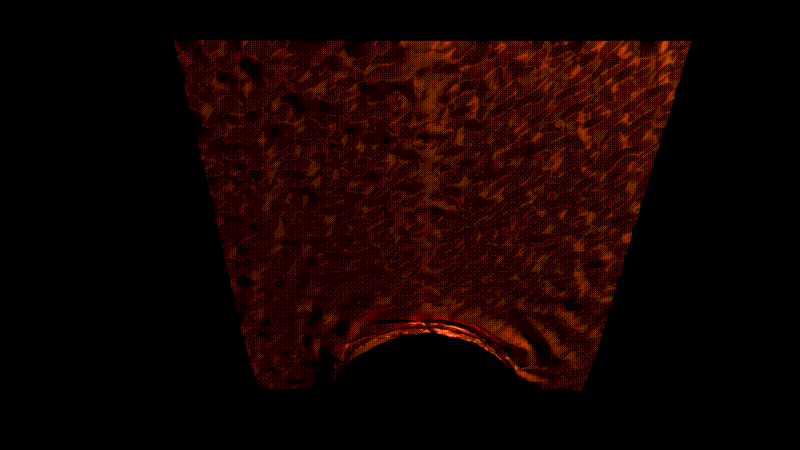
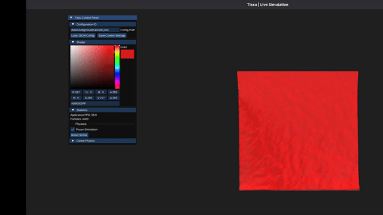

# Tissu


[](https://github.com/evanrock520-ciencias/Tissu/actions/workflows/ci.yml)
[](https://github.com/evanrock520-ciencias/Tissu/actions/workflows/release.yml)

**Tissu** is a C++ cloth simulation SDK designed to integrate seamlessly into Digital Content Creation (DCC) tools such as Blender. It was developed to make high-fidelity cloth simulation as accessible as possible for technical artists and developers.

By combining a high-performance **C++ core** with a flexible **Python API**. Tissu lets you script complex simulations with the simplicity of Python and the velocity of C++.

<!-- HERO GIF: falling cloth on sphere render (pending) -->


## Table of Contents

- [Features](#features)
- [How To Use](#how-to-use)
- [Real-time Viewer](#real-time-viewer)
- [Requirements](#requirements)
- [Supported Operating Systems](#supported-operating-systems)
- [Build and Installation](#build-and-installation)
- [Development and Testing](#development-and-testing)
- [Technical Documentation](#technical-documentation)
- [License](#license)

---

## Features

Tissu includes the following features:

- **IO**
  - Alembic exportation (`.abc`)
  - Wavefront `.obj` importation and exportation
  - State serialization (`.tissu`)
  - Scene loader and exporter (`.json`)
  - Material presets loader (`.json`)

- **Physics (XPBD Solver)**
  - Distance constraint
  - Bending constraint
  - Volume constraint
  - Pin constraint
  - Broad-phase collision detection via Spatial Hash
  - Sphere, capsule and plane colliders
  - Kinematic Colliders
  - Self-collision detection
  - Gravity force
  - Aerodynamic force

- **Python API**
  - Full simulation scripting via `tissu` Python package
  - Event scheduling

### Coming Soon

Features planned for future releases:

- USD exportation
- Mesh colliders
- Stitch constraint
- Full multi-cloth support (viewer + Alembic)

The ultimate goal of **Tissu** is to become a Blender add-on.

---

## How To Use

Let's script a cloth falling onto a sphere collider. The following example demonstrates how to set up a simulation, add constraints, schedule events, and export the result.

```python
from tissu import Simulation

# 1. Initialize the simulation environment
sim = Simulation(substeps=10, iterations=3, thickness=0.05)

# 2. Create a cloth grid
curtain = sim.create_grid(
    name="curtain",
    rows=80,
    cols=80,
    spacing=0.05,
    material="silk"
)

# Pin the top corners to initially hold the curtain in place
curtain.pin_top_corners()

# 3. Add a sphere collider
# (name, initial position, radius, friction)
ball = sim.add_sphere('ball', [2.0, 0.0, 0.0], 1.0, 0.5)

# 4. Schedule an event: Unpin the curtain at frame 40 so it falls
@sim.on_frame(40)
def unpin(sim):
    curtain.unpin()

# 5. Run the simulation and export the result directly to Alembic
output = "data/animations/cloth_on_sphere.abc"
sim.bake_alembic(
    filepath=output,
    start_frame=1,
    end_frame=240,
    fps=60
)
```

---

## Real-time Viewer

Tissu comes with a built-in OpenGL viewer for real-time visualization. If you install **Tissu** with viewer support, you can preview your simulation before baking.

Instead of calling `sim.bake_alembic()`, simply launch the interactive viewer.

```python
sim.view()
```

The viewer includes an integrated ImGui control panel to manage the simulation on the fly. From here, you can:

- Load Scenes, Materials, and Physics presets
- Adjust Shader and World parameters
- Tune Solver parameters in real-time
- Monitor performance statistics



### Keybindings

- <kbd>G</kbd> : Take a state snapshot (.tissu files)
- <kbd>S</kbd> : Take a geometry snapshot (.obj files)
- <kbd>R</kbd> : Reset the simulation
- <kbd>Space</kbd> : Play / Pause the simulation
- <kbd>Left Click</kbd> : Grab and interact with particles manually

---

## Requirements

These dependencies must be installed on your system before building the project:

- Cmake ($\ge$ 3.16)
- C++ Compiler with C++17 support (GCC, Clang, or MSVC)
- [Alembic](https://github.com/alembic/alembic)
- [Imath](https://github.com/AcademySoftwareFoundation/Imath)
- OpenMP

### Python Requirements

To build and use `tissu`, you need:

- Python ($\ge$ 3.8)
- Build Tools: setuptools $\ge$ 61.0, wheel
- Packages: mypy, numpy, tqdm, pytest

> Python dependencies are automatically handled if you install the package via `pip install .`

### Fetched Dependencies (Core)

These dependencies are automatically downloaded and built by CMake via `FetchContent`:

- [Eigen](https://gitlab.com/libeigen/eigen) (3.4.0)
- [tinyobjloader](https://github.com/tinyobjloader/tinyobjloader)
- [nlohmann/json](https://github.com/nlohmann/json) (v3.11.3)
- [pybind11](https://github.com/pybind/pybind11) (v2.13.6)
- [GoogleTest](https://github.com/google/googletest) (v1.15.2) - *For testing*
- [Google Benchmark](https://github.com/google/benchmark) (v1.9.1) - *For benchmarking*

### Standalone Viewer Requirements (Optional)

If the build includes the **standalone viewer** (`TISSU_BUILD_VIEWER=ON`), the following additional dependencies apply:

**System Requirements:**

- **OpenGL** (System graphics libraries)
- **Threads** (Standard OS threading support)

**Fetched Dependencies (Handled by CMake):**

- [GLFW](https://github.com/glfw/glfw) (3.3.8)
- [GLAD](https://github.com/Dav1dde/glad) (v2.0.8, Core 4.6)
- [ImGui](https://github.com/ocornut/imgui) (v1.91.5 - Docking branch)

---

## Supported Operating Systems

- **Linux:** Supported and tested (On Fedora)
- **macOS:** Untested.
- **Windows:** Experimental. (Need more tests)

---

## Build and Installation

### 1. Clone Repository

Cloning the repository is as simple as

```bash
git clone https://github.com/evanrock520-ciencias/Tissu.git
cd Tissu
```

### 2. Compile the SDK

Build the shared library and the standalone viewer using CMake.

```bash
mkdir build
cd build
cmake .. -DCMAKE_BUILD_TYPE=Release
make -j4 
cd ..
```

### 3. Install Tissu

To import the library in your scripts, install the tissu package with pip:

```bash
pip install .
```

> Run this from the root of the repo after building with CMake

---

## Development and Testing

Tissu includes a test suite for both **C++** and **Python**

- **C++ Tests:** Powered by Google Test (`tests/`)
- **Python Tests:** Powered by Pytest (`tests/python/`).
- **Benchmarks:** Powered by Google Benchmark (`benchmarks/`).

---

## Technical Documentation

Technical documentation is currently a work in progress. It is expected to include:

- [Architecture overview](docs/core/architecture.md)
- [Physics & math reference](docs/core/physics_and_math.md)
- [Python API reference](docs/python/api.md)
- [Build & development guide](docs/core/build_and_develops.md)

> Almost all pages may be incomplete or missing content.

---

## License

This project is licensed under the Apache 2.0 License - see the [LICENSE](LICENSE) file for details.
