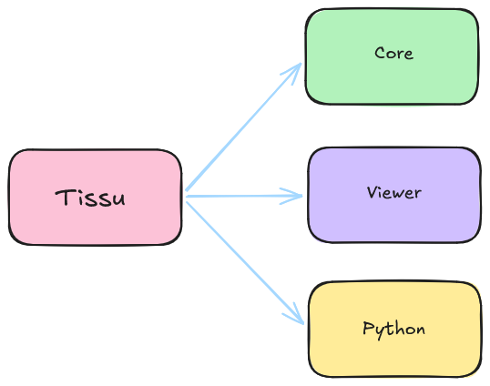
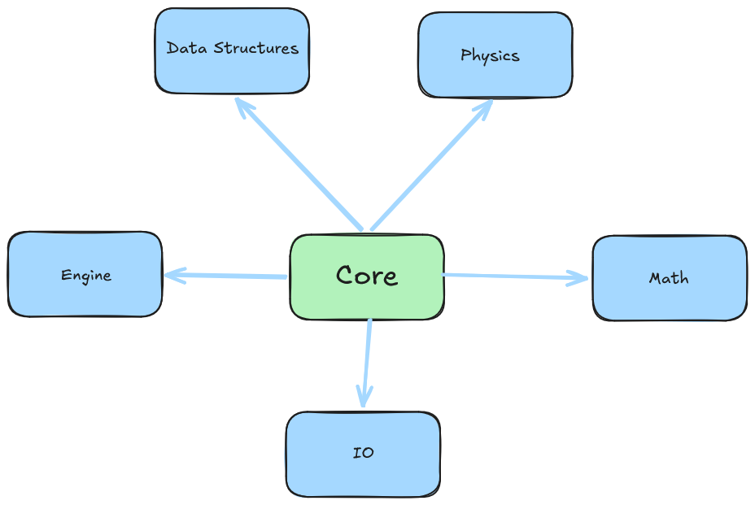
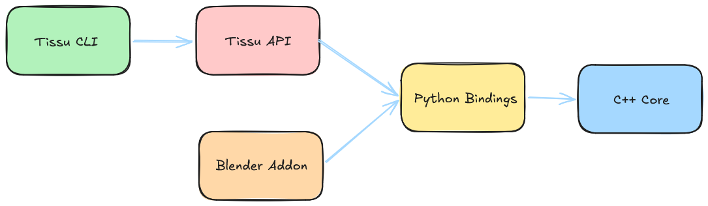

# Architecture

## Structure

### Overview



The structure of Tissu is divided into three main components: the core, the viewer, and the Python API. Each part is
designed with the others in mind, but putting emphasis on the core. The core is the essence of Tissu; it makes
everything else work, as it manages all the simulation state. However, every other component enhances the experience of
using
it. For instance, the viewer is a tool that allows visualizing and interacting with the simulation in real-time,
which is especially useful for debugging before baking the results. The Python API upgrades the usability of the core by
providing
a simpler syntax and removing the need to compile the code for every little modification.

### Core Components

The core contains the most important components of Tissu. All the hard work happens here.

```txt
├───data-structures   // Acceleration structures such as spatial hash or BVH
├───engine            // Data representation 
├───io                // Importers and exporters
├───math              // Math Utilities
├───physics           // XPBD related stuff
└───utils             // Miscelaneous Utilities
```



## Data Flow



The entire Tissu project is built around the C++ core. As Tissu's philosophy is to provide a high-performance simulation
engine alongside an easy-to-use interface, connecting C++ and Python is a key aspect of the project. This would be
almost impossible to achieve without Pybind11, which allows us to expose C++ classes and functions to Python in a very
simple way. This acts as a bridge between all the artist tools built around the core and the core itself.

## Simulation Pipeline

<!-- Describe the high-level steps during a single simulation frame (e.g., Read state -> Integration -> Collision -> Solver). Delegate math to physics_and_math.md -->

## Source Code Structure

<!-- Briefly explain the main directories in the core source code (e.g., /solver, /geometry) so a new dev knows where to look -->

## Architectural Patterns

<!-- Mention the main programming paradigms used, such as Data-Oriented Design (DOD) or OOP. Performance details go to optimization.md -->
