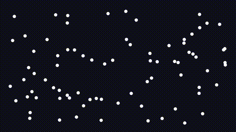

# Optimization

Tissu has several optimization techniques to improve performance and enable real-time applications.
There are many optimization techniques for XPBD; in this section we will focus on the most important ones.

## Spatial Hash

### Overview

Imagine a collection of particles in space. For each particle, we need to determine which other particles it could
potentially collide with. A naive approach involves checking every particle against every other particle—an
$O(n^2)$ operation, which is clearly not viable for real-time applications.


Can the most distant particles possibly collide? Since particles are represented as points
with a fixed radius, the answer is intuitively no—distant particles can never intersect. We can exploit this
spatial locality to optimize our collision detection algorithm, which forms the core idea behind spatial hashing.

Spatial hashing divides the simulation space into a grid of cells. First, we build the spatial hash by assigning each
particle to a cell based on its position. Subsequently, for each particle, we restrict our collision checks to particles
residing in the same cell and its immediate neighbors. This reduces the query time to $O(k)$, where $k$ represents the
number of particles in these local cells, offering a significant performance improvement over the naive approach.



### Build

The initial step involves defining a spatial hash function. This function takes a particle's position $(x, y, z)$ and
maps it to a cell index in the grid, represented as a hash table. It is important to explicitly note that mapping a
virtually infinite 3D grid into a finite array means two distinct, non-adjacent spatial cells can map to the exact same
table index. This is known as a hash collision. While hash collisions do not affect the conceptual correctness of the
query (since we still perform exact distance checks later), they do negatively impact performance by grouping unrelated
particles. By multiplying each coordinate with a large prime number before combining them via XOR, we spread the grid
coordinates more uniformly across the table, which effectively minimizes these collisions.

> [!NOTE]
> In fact the prime numbers used in this implementation are derived from the paper by Teschner et al.

````c++
inline int hashCoords(int x, int y, int z) const {
    unsigned int h = (static_cast<unsigned int>(x) * 73856093) ^
                     (static_cast<unsigned int>(y) * 19349663) ^
                     (static_cast<unsigned int>(z) * 83492791);
    return static_cast<int>(h % m_tableSize);
}
````

Notice the modulo operation uses `m_tableSize`. To keep the average bucket size—and thus the collision cost—low,
`m_tableSize` should be roughly on the order of the total particle count.

However, the preceding function requires discrete integers rather than continuous coordinates. To handle this, we
convert the continuous positions into discrete grid coordinates by dividing each axis by the cell size and flooring the
result. This maps any point in continuous space to a specific discrete grid cell.

```c++
for (size_t i = 0; i < particles.size(); ++i) {
    const Eigen::Vector3d& pos = particles[i].getPosition();

    int gx = static_cast<int>(std::floor(pos.x() / m_cellSize));
    int gy = static_cast<int>(std::floor(pos.y() / m_cellSize));
    int gz = static_cast<int>(std::floor(pos.z() / m_cellSize));

    int h = hashCoords(gx, gy, gz);

    m_particleHashes[i] = h;

    m_cellStart[h]++;
}
```

Next, we compute a prefix sum of each cell's particle count to determine the starting index of each cell within the
sorted particle array. The final step involves sorting the particles; we achieve this by iterating through them and
placing each one in its correct position within the sorted array, guided by its cell's starting index. Consequently, by
the end of this process,`m_particleIndices` contains the particle indices ordered by their respective cell indices. In
essence, this acts as a counting sort algorithm with a time complexity of $O(n)$.

```c++
int sum = 0;
for (int i = 0; i < m_tableSize; ++i) {
    int count = m_cellStart[i];
    m_cellStart[i] = sum;
    sum += count;
}
m_cellStart[m_tableSize] = sum;

m_cellOffset = m_cellStart;

for (size_t i = 0; i < particles.size(); ++i) {
    int hash = m_particleHashes[i];
    int index = m_cellOffset[hash]++;
    m_particleIndices[index] = i;
}
```


### Query

Naturally, after constructing the spatial hash, we need a way to utilize it. The query process is straightforward:
initially, we define a search radius (which is typically $d = 2r$, where $r$ is the particle's radius). The grid cell
size (`m_cellSize`) is an important design decision closely tied to this radius: if it is too small, there is overhead
from traversing many empty cells; if it is too large, many particles fall into a single cell, nullifying the advantage
of the hash.

Following this, we identify all potential cells that might contain particles within this search radius by formulating an
AABB (Axis-Aligned Bounding Box) that fully encloses the search sphere. Afterward, we iterate through the particles
located within those specific cells to evaluate potential collisions.

````c++
void SpatialHash::query(const std::vector<Particle>& particles,
                        const Eigen::Vector3d& pos, double radius,
                        std::vector<int>& outNeighbors) const {
    outNeighbors.clear();
    Eigen::Vector3d sphereRadius(radius, radius, radius);
    Eigen::Vector3d pMin = pos - sphereRadius;
    Eigen::Vector3d pMax = pos + sphereRadius;

    int mingx, mingy, mingz;
    int maxgx, maxgy, maxgz;

    posToGrid(pMin, mingx, mingy, mingz);
    posToGrid(pMax, maxgx, maxgy, maxgz);

    double radiusSq = radius * radius;

    for (int x = mingx; x <= maxgx; ++x) {
        for (int y = mingy; y <= maxgy; ++y) {
            for (int z = mingz; z <= maxgz; ++z) {
                int hash = hashCoords(x, y, z);
                int start = m_cellStart[hash];
                int end = m_cellStart[hash + 1];
                for (int m = start; m < end; ++m) {
                    int pIndex = m_particleIndices[m];
                    double distance =
                        (particles[pIndex].getPosition() - pos).squaredNorm();
                    if (distance < radiusSq)
                        outNeighbors.push_back(pIndex);
                }
            }
        }
    }
}
````

This query function is widely used in the principal simulation loop of the Solver, especially during the self-collision
detection phase. For other collision scenarios, such as particle-to-cloth-mesh interactions, a Bounding Volume
Hierarchy (BVH) is preferable, which is the spatial data structure we will explore in the next section.

## BVH

## Graph Coloring

### Jones-Plassmann Algorithm

## Bibliography

