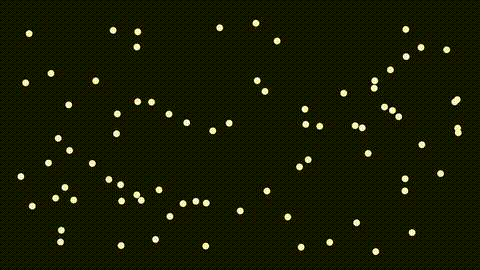
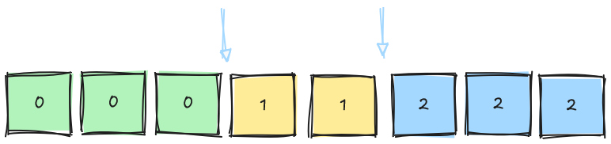
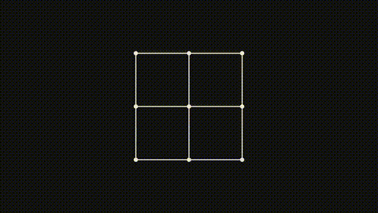

# Optimization

Tissu has several optimization techniques to improve performance and enable real-time applications.
There are many optimization techniques for XPBD; in this section we will focus on the most important ones.

---

## Spatial Hash

### Overview

Imagine a collection of particles in space. For each particle, we need to determine which other particles it could
potentially collide with. A naive approach involves checking every particle against every other particle—an
$O(n^2)$ operation, which is clearly not viable for real-time applications.


Can the most distant particles possibly collide? Since particles are represented as points
with a fixed radius, the answer is intuitively no—distant particles can never intersect. We can exploit this
spatial locality to optimize our collision detection algorithm, which forms the core idea behind spatial hashing.

Spatial hashing divides the simulation space into a grid of cells. First, we build the spatial hash by assigning each
particle to a cell based on its position. Subsequently, for each particle, we restrict our collision checks to particles
residing in the same cell and its immediate neighbors. This reduces the query time to $O(k)$, where $k$ represents the
number of particles in these local cells, offering a significant performance improvement over the naive approach.



### Build

The initial step involves defining a spatial hash function. This function takes a particle's position $(x, y, z)$ and
maps it to a cell index in the grid, represented as a hash table. It is important to explicitly note that mapping a
virtually infinite 3D grid into a finite array means two distinct, non-adjacent spatial cells can map to the exact same
table index. This is known as a hash collision. While hash collisions do not affect the conceptual correctness of the
query (since we still perform exact distance checks later), they do negatively impact performance by grouping unrelated
particles. By multiplying each coordinate with a large prime number before combining them via XOR, we spread the grid
coordinates more uniformly across the table, which effectively minimizes these collisions.

> [!NOTE]
> In fact the prime numbers used in this implementation are derived from the paper by Teschner et al.

````c++
inline int hashCoords(int x, int y, int z) const {
    unsigned int h = (static_cast<unsigned int>(x) * 73856093) ^
                     (static_cast<unsigned int>(y) * 19349663) ^
                     (static_cast<unsigned int>(z) * 83492791);
    return static_cast<int>(h % m_tableSize);
}
````

Notice the modulo operation uses `m_tableSize`. To keep the average bucket size—and thus the collision cost—low,
`m_tableSize` should be roughly on the order of the total particle count.

However, the preceding function requires discrete integers rather than continuous coordinates. To handle this, we
convert the continuous positions into discrete grid coordinates by dividing each axis by the cell size and flooring the
result. This maps any point in continuous space to a specific discrete grid cell.

```c++
for (size_t i = 0; i < particles.size(); ++i) {
    const Eigen::Vector3d& pos = particles[i].getPosition();

    int gx = static_cast<int>(std::floor(pos.x() / m_cellSize));
    int gy = static_cast<int>(std::floor(pos.y() / m_cellSize));
    int gz = static_cast<int>(std::floor(pos.z() / m_cellSize));

    int h = hashCoords(gx, gy, gz);

    m_particleHashes[i] = h;

    m_cellStart[h]++;
}
```

Next, we compute a prefix sum of each cell's particle count to determine the starting index of each cell within the
sorted particle array. The final step involves sorting the particles; we achieve this by iterating through them and
placing each one in its correct position within the sorted array, guided by its cell's starting index. Consequently, by
the end of this process,`m_particleIndices` contains the particle indices ordered by their respective cell indices. In
essence, this acts as a counting sort algorithm with a time complexity of $O(n)$.

```c++
int sum = 0;
for (int i = 0; i < m_tableSize; ++i) {
    int count = m_cellStart[i];
    m_cellStart[i] = sum;
    sum += count;
}
m_cellStart[m_tableSize] = sum;

m_cellOffset = m_cellStart;

for (size_t i = 0; i < particles.size(); ++i) {
    int hash = m_particleHashes[i];
    int index = m_cellOffset[hash]++;
    m_particleIndices[index] = i;
}
```



### Query

Naturally, after constructing the spatial hash, we need a way to utilize it. The query process is straightforward:
initially, we define a search radius (which is typically $d = 2r$, where $r$ is the particle's radius). The grid cell
size (`m_cellSize`) is an important design decision closely tied to this radius: if it is too small, there is overhead
from traversing many empty cells; if it is too large, many particles fall into a single cell, nullifying the advantage
of the hash.

Following this, we identify all potential cells that might contain particles within this search radius by formulating an
AABB (Axis-Aligned Bounding Box) that fully encloses the search sphere. Afterward, we iterate through the particles
located within those specific cells to evaluate potential collisions.

````c++
void SpatialHash::query(const std::vector<Particle>& particles,
                        const Eigen::Vector3d& pos, double radius,
                        std::vector<int>& outNeighbors) const {
    outNeighbors.clear();
    Eigen::Vector3d sphereRadius(radius, radius, radius);
    Eigen::Vector3d pMin = pos - sphereRadius;
    Eigen::Vector3d pMax = pos + sphereRadius;

    int mingx, mingy, mingz;
    int maxgx, maxgy, maxgz;

    posToGrid(pMin, mingx, mingy, mingz);
    posToGrid(pMax, maxgx, maxgy, maxgz);

    double radiusSq = radius * radius;

    for (int x = mingx; x <= maxgx; ++x) {
        for (int y = mingy; y <= maxgy; ++y) {
            for (int z = mingz; z <= maxgz; ++z) {
                int hash = hashCoords(x, y, z);
                int start = m_cellStart[hash];
                int end = m_cellStart[hash + 1];
                for (int m = start; m < end; ++m) {
                    int pIndex = m_particleIndices[m];
                    double distance =
                        (particles[pIndex].getPosition() - pos).squaredNorm();
                    if (distance < radiusSq)
                        outNeighbors.push_back(pIndex);
                }
            }
        }
    }
}
````

This query function is widely used in the principal simulation loop of the Solver, especially during the self-collision
detection phase. For other collision scenarios, such as particle-to-cloth-mesh interactions, a Bounding Volume
Hierarchy (BVH) is preferable, which is the spatial data structure we will explore in the next section.

---

## BVH

---

## Graph Coloring

### Vertex Coloring

Vertex coloring is, in essence, exactly what its name suggests: an assignment of a color to each vertex of a graph. We
can simply think of it as a function that takes a vertex and assigns it a color. But what use is this? Things get
interesting once we start requiring constraints on this function.

`Definition`: Given a graph $G$ and a function $\phi: V(G) \to \{1, 2, ..., k\}$, we say $\phi$ is a proper vertex
coloring if for every edge $uv \in E(G)$ it holds that $\phi(u) \neq \phi(v)$; that is, no pair of adjacent vertices
shares a color.

Every graph has at least one proper vertex coloring (for example, by coloring every vertex a different color). We say a
graph is **k-colorable** if there exists some proper coloring that uses at most $k$ colors. Ideally, we always look for
the coloring that uses the fewest possible colors; this minimum is known as the **chromatic number**, denoted $\chi(G)$.


### Edge Coloring

Edge coloring is essentially the same idea as vertex coloring. We take a function that takes an edge and assigns it a
color. And of course, it can also be defined with constraints.

`Definition`: Given a graph $G$ and a function $\phi: E(G) \to \{1, 2, ..., k\}$, we say $\phi$ is a proper edge
coloring if two edges incident to the same vertex never share a color.

Again, every graph has at least one proper edge coloring. A graph is **k-edge-colorable** if there exists a proper
coloring that uses at most $k$ colors, and the minimum number of colors needed is known as the **chromatic index**,
denoted $\chi'(G)$.


### Concept

For each color defined in a proper coloring, we can find an equivalence class called a **chromatic class**. A chromatic
class contains all the vertices or edges colored with a given color. This way, each class is an independent set; that
is, there are no edges between vertices that share a class (by definition of proper coloring). This property is
extremely useful for parallelizing systems, since because each set is independent, all vertices in a chromatic class can
be processed in parallel without running into race conditions.


Specifically, in the case of **Tissu**, we aren't looking to parallelize vertices but rather edges that
represent **constraints** of the ***XPBD*** simulation method. Therefore, it's especially important to understand that
we can transform edge-coloring problems into vertex-coloring problems by means of the **line graph**. That is, an edge
coloring of a graph $G$ is equivalent to a vertex coloring of the line graph $L(G)$.


With this in hand, we can reduce the parallelization problem to a vertex-coloring problem on the mesh. However,
computationally, solving any graph-coloring problem carries the label of being **NP-hard**. In simple terms, we cannot
find the perfect solution in a reasonable amount of time, let alone in real time. Still, there's no need to be
discouraged, since computational heuristics exist: algorithms that produce suboptimal solutions to solve the problem in
a reasonable amount of time.

Specifically, **Tissu** adopts the [Jones-Plassmann](#jones-plassmann-algorithm) algorithm, which we'll examine in more
depth in the next section of the documentation.

## Jones-Plassmann Algorithm

As we saw in the previous section, solving vertex coloring on the Line Graph $L(G)$ lets us find the equivalent coloring
on the mesh $G$. This is especially relevant because XPBD requires, by design, solving linear equation systems using the
Gauss-Seidel method — an iterative method that intrinsically depends on a sequential order, and is therefore harder to
parallelize than other popular methods like Jacobi. Edge coloring then gives us a way to group constraints into
independent sets that can be solved in parallel without running into **race conditions**.

Now, since graph coloring is an **NP-complete** problem, there is no guarantee of finding an optimal solution in
reasonable time. To tackle this type of problem there are different approaches — Genetic Algorithms, Dynamic
Programming, Approximation Algorithms, among others — and the category that Jones-Plassmann belongs to: **Heuristics**.
Broadly speaking, a heuristic is a set of rules and strategies that guide an algorithm toward finding fast and
good-enough solutions to complex problems, though without any guarantee of optimality. This heuristic was created by
Mark Jones and Paul Plassmann, who proposed this graph coloring heuristic based on Luby's Monte Carlo algorithm.

---

### Fundamentals

The Jones-Plassmann algorithm aims to solve problems involving Graph Coloring using a technique called _Maximal
Independent Sets_ (MIS); that is, we're not looking for the largest independent sets, but rather those where adding one
more vertex would break the set's independence. To do this, it relies on a Monte Carlo–type rule:

Let $\rho(v)$ be a random number assigned exactly once to each $v \in V(G)$ at the start of the algorithm. Let $V'$ be
the set of vertices not yet colored (initially $V' = V(G)$):

1. $v \in I \iff \rho(v) > \rho(w)$, $\forall w \in N_G(v) \cap V'$

In other words, a vertex enters the independent set $I$ if its $\rho$ value is greater than that of all its
still-uncolored neighbors. Unlike Luby's algorithm, these $\rho$ values aren't recalculated each round: they're fixed
once, which is precisely what allows Jones-Plassmann to eliminate global synchronization between processors.

This algorithm has a defined bound of at most $\Delta + 1$, where $\Delta$ is the maximum degree of the graph. Although
in practice it tends to behave considerably more efficiently. It is therefore quite useful for our case, i.e.
parallelizing **Tissu**.



---

### Implementation

We split the solution into 2 main functions: `buildFrom` and `colorBatches`

### `buildFrom`

This is where the parallelization initialization begins. Once we have the meshes defined in `World Space`, for each
mesh $G$ we obtain its corresponding line graph $L(G)$. It's important to note that we don't build a graph as an
explicit data structure — we rely on auxiliary structures to reach the same result without needing that intermediate
layer.

**1. Mapping particles to constraints**

Since each constraint stores, by contract, the ID of every particle that affects it, we can easily build an
`unordered_map` that, for each particle, lists the constraints that involve it:

```c++
std::unordered_map<int, std::vector<int>> particleToConstraints;

for (int idx = 0; idx < m_nodeCount; idx++) {
    for (int pid : constraints[idx]->getParticleIds()) {
        particleToConstraints[pid].push_back(idx);
    }
}
```

**2. Building adjacency between constraints**

With that map built, we iterate over each particle and, for every pair of constraints that share it, mark them as
neighbors of each other in `m_adjacency`. Two constraints that share a particle are, by definition, adjacent in $L(G)$.

```c++
for (const auto& [pid, constraintList] : particleToConstraints) {
    for (int a = 0; a < (int)constraintList.size(); a++) {
        for (int b = a + 1; b < (int)constraintList.size(); b++) {
            int idx = constraintList[a];
            int jdx = constraintList[b];

            auto& ni = m_adjacency[idx];
            if (std::find(ni.begin(), ni.end(), jdx) == ni.end()) {
                ni.push_back(jdx);
                m_adjacency[jdx].push_back(idx);
                m_edgeCount++;
            }
        }
    }
}
```

**3. Assigning random weights**

Finally, we finish the construction with JP's initial step: we create a Mersenne Twister random number generator and a
uniform distribution over the range $[0.0, 1.0)$. Then, we assign each node in the line graph a corresponding $\rho(v)$
value:

```c++
std::mt19937 rng(seed);
std::uniform_real_distribution<double> dist(0.0, 1.0);

for (int i = 0; i < m_nodeCount; i++)
	m_weights[i] = dist(rng);
```

### `colorBatches`

With the line graph built and the $\rho(v)$ weights assigned, `colorBatches` runs the Jones-Plassmann heuristic itself,
producing a list of _batches_ (independent sets) that can be solved in parallel.

**1. Initialization**

We maintain three auxiliary structures: `color` (the batch assigned to each node, `-1` if not yet colored), `done` (
whether the node has already left the uncolored set $V'$) and `batches` (the list of results). The algorithm runs while
there are still unprocessed nodes:

```c++
std::vector<int> color(m_nodeCount, -1);
std::vector<char> done(m_nodeCount, 0);
std::vector<std::vector<int>> batches;
int processedNodes = 0;
while (processedNodes < m_nodeCount) {
```

**2. Parallel search for the maximal independent set**

In each round, each thread iterates in parallel (`#pragma omp for`) over its portion of not-yet-processed nodes. A node
`idx` "wins" — meaning it enters this round's independent set — if its $\rho$ weight is greater than **all** of its
neighbors that are still in $V'$ (not marked as `done`).

```c++
std::vector<int> localBatch;
#pragma omp for
for (int idx = 0; idx < m_nodeCount; idx++) {
    if (done[idx])
        continue;
    bool wins = true;
    for (int neighbor : neighbors(idx)) {
        if (!done[neighbor] &&
            m_weights[neighbor] > m_weights[idx]) {
            wins = false;
            break;
        }
    }
    if (wins) {
        localBatch.push_back(idx);
    }
}
```

Each thread accumulates its winners in a private `localBatch`.

**3. Consolidating the round**

Once all threads finish their search, we enter a critical region (`#pragma omp critical`) to dump the local results into
the shared structures. Here each winning node is marked as `done`, assigned its batch number, and added to this round's
`currentBatch`:

```c++
#pragma omp critical
{
    for (int idx : localBatch) {
        if (!done[idx]) {
            done[idx] = 1;
            color[idx] = (int)batches.size();
            currentBatch.push_back(idx);
            processedNodes++;
        }
    }
}
```

**4. Closing the round**

If the round produced at least one winning node, `currentBatch` is added to the final `batches` list. The loop repeats
until all nodes have been colored:

```c++
if (!currentBatch.empty()) {
    batches.push_back(currentBatch);
}
```

Although useful for overall performance, this technique can become counterproductive if overused. Every time a new
constraint is added to any of the meshes, the current graph must be regenerated, since the coloring could become invalid
within the new graph. Specifically, in **Tissu**, new `Collision Constraints` are generated by the dozens during every
frame. Collisions between meshes are very complex, and parallelizing them is an equally difficult task. That's why in
the next section we'll explore **Grid Coloring**.

## Bibliography
