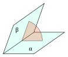

# Physics And Math

This section describes the physical and mathematical foundations of Tissu.

## The Particle

A particle in Tissu is the simplest possible representation of matter: a point of mass in 3D space.
It represents just a position and a mass. Every piece of cloth is a collection of these points, connected by constraints
that define how can move relative to each other.


## Motion

Computers work with discrete data, but physical phenomena are often
modeled with continuous mathematics. In particular Newton's laws of motion are modeled
this way.

$$F = m \ddot{x}$$

We cannot solve equations of motion exactly, so we must approximate them numerically.
Even though the solutions are not exact, they are accurate enough to produce a
believable result.

There are 3 popular approaches to estimate a particle's position.

- Euler
- Verlet
- Runge-Kutta

### Euler

The Euler's method is given by the next equations.

$$x_{n+1} = x_n + v_n ⋅ Δt$$

$$v_{n+1} = v_n + a_n ⋅ Δt$$

Where:

- $x_n$ is the current position.
- $v_n$ is the current velocity.
- $a_n$ is the current acceleration.
- $Δt$ is the timestep.

This is likely the most naïve approach to solve the problem.

Euler's method is an example of a stepwise method — $x_{n+1}$ and
$v_{n+1}$ at $t + \Delta t$ depend only on values at $t$. The local
truncation error grows as $O(\Delta t^2)$, which means the method is
stable when $\Delta t$ is small enough. However, as $\Delta t$ increases
the error accumulates and the simulation tends to overshoot, adding
energy to the system each step instead of conserving it.

In cloth simulation this is critical. A solver runs hundreds of substeps
per second, and an unstable integrator would cause particles to explode
almost immediately. This is why we need a more stable approach.


### Verlet

The Verlet method is given by the following equation.

$$x_{n+1} = 2 ⋅ x_n - x_{n-1} + a_n ⋅ Δt²$$

Where:

- $x_n$ is the current position.
- $x_{n-1}$ is the previous position.
- $a_n$ is the current acceleration.
- $Δt$ is the timestep.

Verlet is a widely used integrator in physics simulation and computer graphics,
valued for its stability and low computational cost. Unlike Euler, Verlet is nearly
symplectic — meaning it approximately conserves the total energy of the system over time,
preventing the artificial energy drift that makes Euler unreliable for cloth simulation.

This is a **two-step** integrator: the next position is estimated from both the current and
the previous position, rather than relying solely on velocity and $Δt$.
As a consequence, velocity is implicit — it does not appear in the update equation directly.
When needed, it can be recovered as:

$$v_n = \frac{x_n - x_{n-1}}{Δt}$$

Verlet's equation can be derived from a Taylor Series expansion. This derivation reveals that
the local truncation error on position is $O(Δt⁴)$, which is significantly better than Euler's
$O(Δt²)$. The global error over a full simulation remains $O(Δt²)$, but the method's symmetry
suppresses the energy drift that accumulates with non-symplectic integrators.


Tissu uses Verlet integration as it's core integration.

```cpp

void Particle::integrate(double deltaTime) {
    Eigen::Vector3d velocity = (m_position - m_oldPosition) * m_damping;
    Eigen::Vector3d currentPos = m_position;

    m_position = m_position + velocity + m_acceleration * (deltaTime * deltaTime);
    
    m_oldPosition = currentPos;
    clearForces();
}
```

However, integration alone is not enough. We still need a way to enforce physical rules
that define how cloth behaves.

## PBD

Usually, the cloth simulation approaches are force based. This means, internal and external forces
are applied directly to the particles, and then the integrator is used to update their positions and velocities.
While this approach is simple and intuitive, tends to be unstable.


PBD is an alternative approach to force-based simulation. Instead of applying forces, PBD works directly with
constraints that define the relationships between particles. For instance, a distance constraint forces two particles
to maintain a certain distance from each other. The simulation iteratively adjusts the positions of the particles to
satisfy these constraints.
This allows for more stable simulations, while still being able to produce fast and realistic results.


### Dynamic Object

We represent a dynamic object as a set of $N$ vertices and $M$ constraints.
Each vertex $i$ has a position $x_i$ and a mass $m_i$, and each constraint consist of a
function $C_j : \mathbb{R}^{3N} \to \mathbb{R}$, a set of indices
$I_j \subseteq \{1, \ldots, N\}$, and a stiffness parameter $k_j \in [0, 1]$.
A constraint with type equality is satisfied when $C_j(x_{I_j}) = 0$ and a constraint with type inequality is satisfied
when $C_j(x_{I_j}) \geq 0$.

### Loop

The PBD algorithm consists of the following steps:

$$
\begin{array}{l}
\textbf{PBD Loop} \\
\hline
(1)  \mathbf{forall} \text{ vertices } i \\
(2)  \quad \text{initialize } x_i = x_i^0, \; v_i = v_i^0, \; w_i = 1/m_i \\
(3)  \mathbf{endfor} \\
(4)  \mathbf{loop} \\
(5)  \quad \mathbf{forall} \text{ vertices } i \;\mathbf{do}\; v_i \leftarrow v_i + \Delta t \cdot w_i \cdot f_{ext}(x_i) \\
(6)  \quad \text{dampVelocities}(v_1, \dots, v_N) \\
(7)  \quad \mathbf{forall} \text{ vertices } i \;\mathbf{do}\; p_i \leftarrow x_i + \Delta t \cdot v_i \\
(8)  \quad \mathbf{forall} \text{ vertices } i \;\mathbf{do}\; \text{generateCollisionConstraints}(x_i \rightarrow p_i) \\
(9)  \quad \mathbf{loop} \text{ solverIterations times} \\
(10) \quad\quad \text{projectConstraints}(C_1, \dots, C_{M+M_{coll}}, w_1, \dots, w_N, p_1, \dots, p_N) \\
(11) \quad \mathbf{endloop} \\
(12) \quad \mathbf{forall} \text{ vertices } i \\
(13) \quad\quad v_i \leftarrow (p_i - x_i)/\Delta t \\
(14) \quad\quad x_i \leftarrow p_i \\
(15) \quad \mathbf{endfor} \\
(16) \quad \text{velocityUpdate}(v_1, \dots, v_N) \\
(17) \mathbf{endloop}
\end{array}
$$

The algorithm consists of three main steps:

1. **Position Update**: In (5) we update the velocity of each particle based on external forces, and in (7) we predict
   the new position of each particle based on
   its current position and velocity.

2. **Constraint Projection**: In (10) we manipulate the predicted positions of the particles to satisfy the constraints.
   This is done iteratively, and the number of iterations is defined by the `solverIterations` parameter.

3. **State Update**: In (13) and (14) we update the velocity and position of each particle based on the projected
   positions.

Let's notice some important points about this algorithm:

- The algorithm is iterative
- The resulting system of equations is non-linear
- The constraints are solved with a Gauss-Seidel approach
- It's compatible with Verlet integration

### Constraint Projection

Step (10), `projectConstraints`, is where PBD actually enforces each $C_j$. For a single constraint involving
vertices $I_j$, the position correction of vertex $i \in I_j$ is:

$$\Delta p_i = -s \, w_i \, \nabla_{p_i} C(p_1, \dots, p_N)$$

where $s$ is the **scaling factor**, defined as:

$$s = \frac{C(p_1, ..., p_N)}{\sum_{i=1}^N w_i \, |\nabla_{p_i} C(p_1, ..., p_N)|^2}$$

The scaling factor distributes the correction among all particles involved in the constraint, weighted by their inverse
mass $w_i$ and by how strongly each particle's position affects the constraint (its gradient). Particles with higher
mass (lower $w_i$) move less, and a particle with infinite mass ($w_i = 0$) does not move at all.

### Distance Constraint

Probably the most common constraint in cloth simulation is the distance constraint. This constraint enforces that two
particles maintain a certain distance from each other.
It is defined as follows:

$$C(p_1, p_2) = \|p_1 - p_2\| - d$$

Where $p_1$ and $p_2$ are the positions of the two particles, and $d$ is the rest length of the constraint. The gradient
of this constraint with respect to the positions of the particles is given by:

$$\nabla_{p_1} C(p_1, p_2) = \frac{p_1 - p_2}{\|p_1 - p_2\|}, \qquad \nabla_{p_2} C(p_1, p_2) = \frac{p_2 - p_1}{\|p_1 - p_2\|}$$

Both gradients are unit vectors $n$ and $-n$ pointing along the line joining the two particles,
so $|\nabla_{p_1} C| = |\nabla_{p_2} C| = 1$. Plugging this into the general scaling factor gives:

$$s = \frac{C(p_1, p_2)}{w_1 + w_2}$$

and applying $\Delta p_i = -s \, w_i \, \nabla_{p_i} C$ to each particle yields the familiar distance constraint
correction:

$$\Delta p_1 = - \frac{w_1}{w_1 + w_2} (\|p_1 - p_2\| - d) \cdot n$$

$$\Delta p_2 = + \frac{w_2}{w_1 + w_2} (\|p_1 - p_2\| - d) \cdot n$$


## XPBD

XPBD born from the need to improve the time step and iterations dependency of PBD. This trouble was particularly
problematic
when creating scenes with multiple materials. As every material has different parameters, the simulation would require a
different number of iterations to converge for each material.
This would lead to a situation where some materials would be over-constrained while others would be under-constrained,
resulting in unrealistic and inefficient behavior.

XPBD brings us a solution to this problem by introducing: **compliance** and a total Lagrange multiplier to PBD.

### Loop

The XPBD algorithm consists of the following steps:

$$
\begin{array}{l}
\textbf{Algorithm 1 } \text{XPBD simulation loop} \\
\hline
(1)  \quad \text{predict position } \tilde{\mathbf{x}} \Leftarrow \mathbf{x}^n + \Delta t \mathbf{v}^n + \Delta t^2 \mathbf{M}^{-1} \mathbf{f}_{ext}(\mathbf{x}^n) \\
(2)  \\
(3)  \quad \text{initialize solve } \mathbf{x}_0 \Leftarrow \tilde{\mathbf{x}} \\
(4)  \quad \text{initialize multipliers } \lambda_0 \Leftarrow \mathbf{0} \\
(5)  \quad \mathbf{while} \text{ } i < \textit{solverIterations} \text{ } \mathbf{do} \\
(6)  \quad\quad \mathbf{for \text{ } all} \text{ constraints } \mathbf{do} \\
(7)  \quad\quad\quad \text{compute } \Delta\lambda \text{ using Eq (18)} \\
(8)  \quad\quad\quad \text{compute } \Delta\mathbf{x} \text{ using Eq (17)} \\
(9)  \quad\quad\quad \text{update } \lambda_{i+1} \Leftarrow \lambda_i + \Delta\lambda \\
(10) \quad\quad\quad \text{update } \mathbf{x}_{i+1} \Leftarrow \mathbf{x}_i + \Delta\mathbf{x} \\
(11) \quad\quad \mathbf{end \text{ } for} \\
(12) \quad\quad i \Leftarrow i + 1 \\
(13) \quad \mathbf{end \text{ } while} \\
(14) \\
(15) \quad \text{update positions } \mathbf{x}^{n+1} \Leftarrow \mathbf{x}_i \\
(16) \quad \text{update velocities } \mathbf{v}^{n+1} \Leftarrow \frac{1}{\Delta t} (\mathbf{x}^{n+1} - \mathbf{x}^n) \\
\hline
\end{array}
$$

Unlike PBD, each constraint $j$ now carries its own **compliance** $\alpha_j$ (the inverse of stiffness) and its own
Lagrange multiplier $\lambda_j$, which accumulates across solver iterations instead of being discarded after each one.
This is what removes PBD's dependency on the number of solver iterations and the time step.

### Constraint Update

For a constraint $C_j$ involving vertices with weights $w_i$, the multiplier and position updates referenced in the loop
above (Eq. 18 and Eq. 17) are:

$$\Delta \lambda_j = \frac{-C_j(\mathbf{x}) - \tilde{\alpha}_j \, \lambda_j}{\sum_i w_i \, |\nabla_{x_i} C_j(\mathbf{x})|^2 + \tilde{\alpha}_j} \tag{18}$$

$$\Delta \mathbf{x}_i = w_i \, \Delta \lambda_j \, \nabla_{x_i} C_j(\mathbf{x}) \tag{17}$$

where $\tilde{\alpha}_j = \alpha_j / \Delta t^2$ is the compliance rescaled by the time step. Note that
when $\alpha_j = 0$ (infinite stiffness) and a single solver iteration is used, this reduces to the PBD update.

### Distance Constraint

Using the same distance constraint $C(p_1, p_2) = \|p_1 - p_2\| - d$ and
gradients $\nabla_{p_1} C = n$, $\nabla_{p_2} C = -n$ defined earlier, the XPBD update becomes:

$$\Delta \lambda = \frac{-C(p_1, p_2) - \tilde{\alpha} \, \lambda}{w_1 + w_2 + \tilde{\alpha}}$$

$$\lambda \leftarrow \lambda + \Delta \lambda$$

$$\Delta p_1 = w_1 \, \Delta \lambda \, n, \qquad \Delta p_2 = -w_2 \, \Delta \lambda \, n$$

The multiplier $\lambda$ is reset to zero once per timestep (at the start of the solver loop, step (4) of Algorithm 1)
and accumulates over the `solverIterations`, unlike $s$ in plain PBD which is recomputed from scratch every iteration
with no memory of previous corrections.

The following code implements the distance constraint in Tissu:

```cpp
void DistanceConstraint::solve(std::vector<Particle>& particles, double dt) {
  Particle& pA = particles[m_idA];
  Particle& pB = particles[m_idB];

  Eigen::Vector3d delta = pA.getPosition() - pB.getPosition();
  double currentLength = delta.norm();

  if (currentLength < 1e-6) return;

  double wA = pA.getInverseMass();
  double wB = pB.getInverseMass();
  double wSum = wA + wB;
  if (wSum == 0.0) return;

  Eigen::Vector3d n = delta / currentLength;
  double C = currentLength - m_restLength;

  double alphaHat = m_compliance / (dt * dt);
  double deltaLambda = (-C - alphaHat * m_lambda) / (wSum + alphaHat);
  m_lambda += deltaLambda;

  pA.setPosition(pA.getPosition() + wA * n * deltaLambda);
  pB.setPosition(pB.getPosition() - wB * n * deltaLambda);
}
```

### Bending Constraint

This constraint is used to simulate the resistance of cloth to bending. We use 4 particles to define the restriction
function.
The restriction is based on the dihedral angle between the two triangles formed by the 4 particles.

Theoretically, the **dihedral angle** is the angle between two planes, but here the angle is measured between the
normals of the two triangles.



The constraint is defined as follows:

$$C_{\text{bend}}(p_1, p_2, p_3, p_4) = arccos\left(\frac{(n_1) \cdot (n_2)}{||n_1|| \, ||n_2||}\right)$$

To explain this, let's define two triangles as follows:

- Triangle 1: $p_1, p_2, p_3$
- Triangle 2: $p_1, p_2, p_4$

## References

* M. Müller, B. Heidelberger, M. Hennix and J. Ratcliff, "Position based dynamics", Journal of Visual Communication and
  Image Representation 18, 2, 2007
* M. Macklin, M. Müller and N. Chentanez, "XPBD: Position-based Simulation of Compliant Constrained Dynamics",
  Proceedings of the 9th International Conference on Motion in Games (MIG), 2016